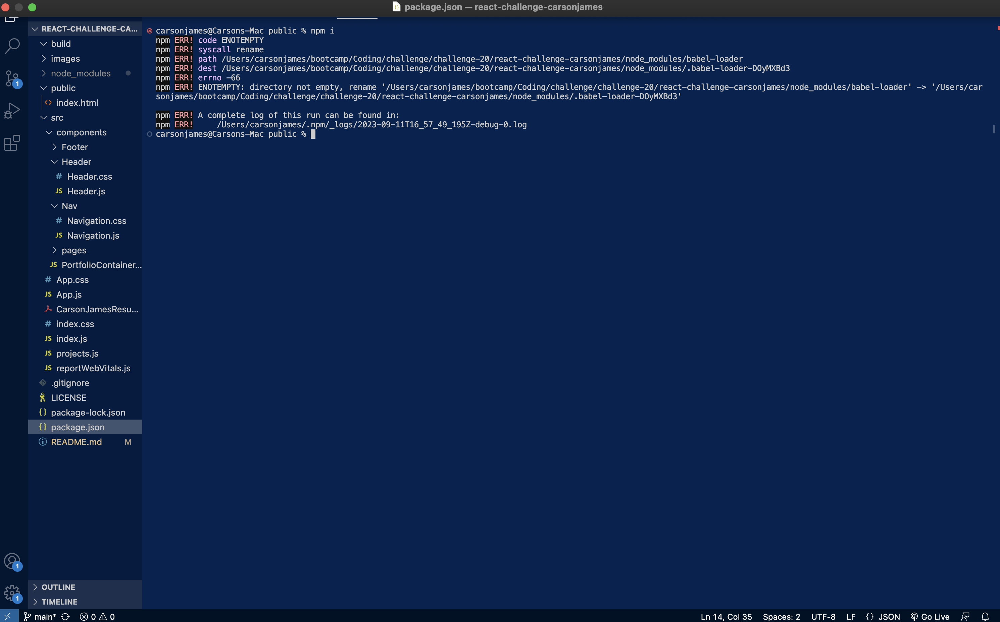
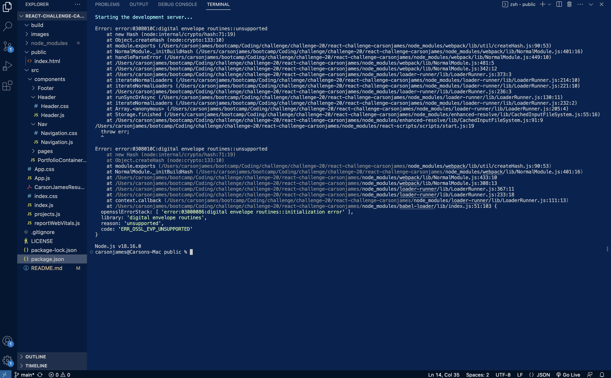
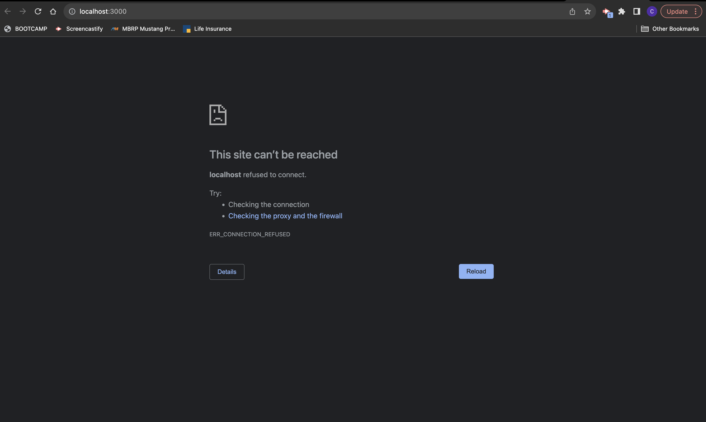

# React Portfolio - Carson James

## Description

This project was designed to test our skill and knowledge in React as well as other components from previous lessons. This application was built to show off our projects that we have created. Within the apllication there is an about me section, links to my social media accounts, and my github. The applications displayed are also linked to their respective pages and live URL's. The webpage uses React and other components to make it more user friendly and user responsive. The problem it solves is that it gives a resume a new look allowing people to view the page and get a better understadning of the skills I have through the use of including live look ins at the work we have completed. 

## Installation

npm i 

## Usage

GitHub: https://github.com/carsonjames1125/react-challenge-carsonjames

URL: https://carsonjames1125.github.io/react-challenge-carsonjames/

## Credits

https://babeljs.io/docs/usage

https://www.knowledgehut.com/blog/web-development/package-json-scripts-node-js

https://mui.com/material-ui/getting-started/

https://react.dev/learn

https://web.dev/vitals/

## License

MIT License

Copyright (c) [2023] [carsonjames1125]

Permission is hereby granted, free of charge, to any person obtaining a copy
of this software and associated documentation files (the "Software"), to deal
in the Software without restriction, including without limitation the rights
to use, copy, modify, merge, publish, distribute, sublicense, and/or sell
copies of the Software, and to permit persons to whom the Software is
furnished to do so, subject to the following conditions:

The above copyright notice and this permission notice shall be included in all
copies or substantial portions of the Software.

THE SOFTWARE IS PROVIDED "AS IS", WITHOUT WARRANTY OF ANY KIND, EXPRESS OR
IMPLIED, INCLUDING BUT NOT LIMITED TO THE WARRANTIES OF MERCHANTABILITY,
FITNESS FOR A PARTICULAR PURPOSE AND NONINFRINGEMENT. IN NO EVENT SHALL THE
AUTHORS OR COPYRIGHT HOLDERS BE LIABLE FOR ANY CLAIM, DAMAGES OR OTHER
LIABILITY, WHETHER IN AN ACTION OF CONTRACT, TORT OR OTHERWISE, ARISING FROM,
OUT OF OR IN CONNECTION WITH THE SOFTWARE OR THE USE OR OTHER DEALINGS IN THE
SOFTWARE.

---

## Badges

n/a

## Features

n/a

## How to Contribute

n/a

## Tests

n/a